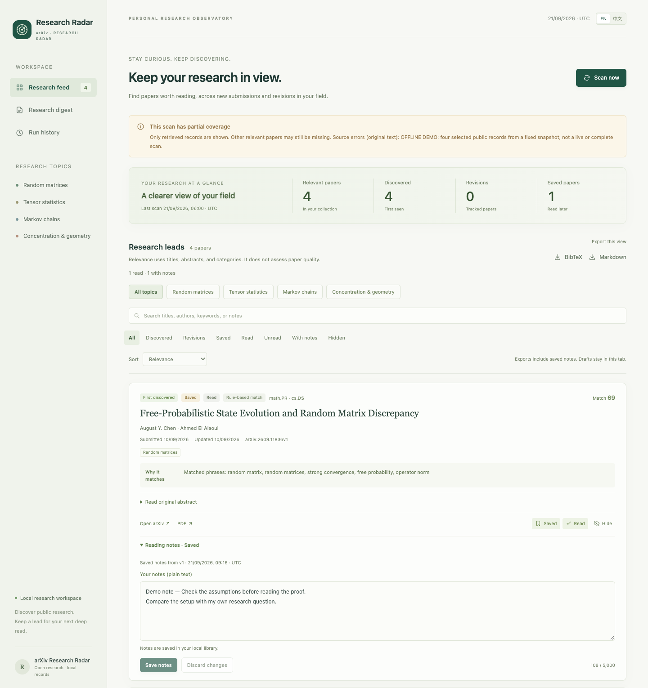

# arXiv Research Radar

**A local research feed with explainable ranking, version tracking, and evidence-checked agent reviews.**

[简体中文](README.zh-CN.md) · [Agent harness](docs/agent-harness.md) · [Configuration](docs/configuration.md) · [Contributing](CONTRIBUTING.md)

Keep up with a research area without losing track of why a paper was recommended—or whether a scan actually completed.



## What it does

- **Retrieve:** scan official arXiv metadata by research category, with pagination, request pacing, retries, and archived responses.
- **Rank:** match titles and abstracts against a configurable research profile; show the terms behind each recommendation.
- **Remember:** deduplicate cross-listed papers in SQLite, distinguish first discovery from a new version, and preserve reading feedback.
- **Review:** export a queue for a human or coding agent, then validate imported reviews against the stored paper version and exact abstract quotes.
- **Read:** save and mark papers as read independently, keep version-aware reading notes, sort and search your library, and export the current results as Markdown or BibTeX.
- **Evaluate:** run a reproducible offline relevance evaluation with explicit labels, inspect false positives and missed papers, and fingerprint the dataset and profile used.
- **Report coverage:** mark interrupted, capped, or fallback scans explicitly. An RSS fallback never counts as a complete historical scan.

The retrieval and dashboard use **only the Python standard library**. No model API key is required. The application does **not** call an LLM itself; optional reviews are generated by an external agent and imported as JSON. See the [review contract](docs/agent-harness.md).

## Quick start

Requires **Python 3.10+ on macOS or Linux**. Windows is not currently supported because scan locking uses `fcntl`.

```bash
git clone https://github.com/xiangyanjin/arxiv-research-radar.git
cd arxiv-research-radar
```

**Try an offline snapshot first:**

```bash
python3 examples/load_demo.py
ARXIV_RADAR_DATA_DIR=data/demo python3 -m radar serve
```

Open **[http://127.0.0.1:8765](http://127.0.0.1:8765)**. The demo uses a labeled subset of public metadata in an isolated `data/demo` directory. It is a snapshot, not a live or complete scan.

**Start your own collection:** stop the demo server, then run:

```bash
python3 -m radar scan
python3 -m radar serve
```

Keep the server terminal running while using the dashboard. You can also run `serve` first and start a scan from the interface.

The first scan looks back 14 days by default. Later scans overlap the last completely covered interval, so a failed scan does not silently skip a day. A broad category selection can take several minutes; progress and coverage are recorded locally.

## Make it yours

```bash
cp config/profile.json config/profile.local.json
```

Edit the local copy to set your categories, topics, keywords, and recommendation threshold. It is excluded from Git and takes precedence over the bundled profile. The starter profile covers random matrices, tensor statistics, Markov chains, and concentration inequalities; it is an example you can replace.

Use `ARXIV_RADAR_PROFILE` for a different profile path and `ARXIV_RADAR_DATA_DIR` for a different data directory. [Configuration details →](docs/configuration.md)

## Turn discoveries into a reading library

Bookmark a paper, mark it as read, and write a short note without losing any of the other states. Notes survive rescans and paper revisions; the dashboard identifies the paper version the note was saved against. Unsubmitted note drafts stay in the current browser tab across filters and refreshes until you save or discard them.

Use **Saved**, **Read**, **Unread**, or **With notes**, search your notes alongside titles and abstracts, and sort by relevance, newest update, or title. Saved/read/noted papers remain accessible in those library views even after a research-profile change lowers their score. **Export BibTeX** and **Export reading list** export all results in the current view, with its filters and ordering, rather than silently switching to another collection. Markdown notes are labeled as your own notes.

Existing databases upgrade automatically. See [reading-library details](docs/reading-library.md) for state, migration, and export semantics.


## Make ranking changes measurable

```bash
python3 -m radar evaluate examples/ranking-eval.json --profile config/profile.json --k 5 --output output/evaluation.json
```

This reports precision, recall, F1, top-k metrics, and the exact false positives and negatives. The bundled **20 fictional, hand-labeled examples are synthetic regression cases**, not a real-world benchmark. They intentionally include keyword-negation and paraphrase failures. Replace them with independently labeled examples from your own field before judging recommendation usefulness. [Evaluation format and metric definitions →](docs/evaluation.md)

## A small, inspectable harness

```text
arXiv API ──→ archived metadata ──→ SQLite + relevance rules ──→ dashboard
     │                                  │
     └─ RSS fallback (partial)           └─ review queue
                                                │
                                     human / external agent
                                                │
                                     version + quote checks
                                                │
                                    digest + notification ledger
```

```bash
python3 -m radar review-queue --output data/review-queue.json
# An external agent reads this queue and writes data/reviews.json.
python3 -m radar import-reviews data/reviews.json
python3 -m radar digest
```

The [agent harness guide](docs/agent-harness.md) includes the JSON contract and a reusable prompt. It can be followed by a coding agent that has shell and file access; no dedicated Codex or Claude Code integration is bundled.

## Daily operation

Use your preferred scheduler to invoke the CLI. **Cloning or starting the dashboard does not install or activate a scheduled task.** The [scheduling guide](docs/scheduling.md) covers time zones, complete versus partial runs, and notification deduplication.

| Command | Purpose |
| --- | --- |
| `python3 -m radar scan --days 7` | Request a seven-day scan |
| `python3 -m radar status` | Inspect the latest run and stored state |
| `python3 -m radar delivery-plan --output data/delivery-plan.json` | Prepare a list of unacknowledged discoveries and versions |
| `python3 -m radar acknowledge data/delivery-plan.json` | Record the prepared notification scope locally |
| `python3 -m radar serve --port 8766` | Run the dashboard on another local port |

`acknowledge` is a local ledger operation, not proof that an email or chat message was delivered. No email or messaging connector is bundled.

## Scope and limitations

- Relevance scores are rule-based matches, **not** calibrated probabilities, paper-quality scores, or proof verification.
- Reviews use **abstracts only**. Exact-quote validation catches mismatched evidence and stale versions; it does not establish that every generated statement is correct.
- RSS dates describe announcements. They are kept separate from API submission and revision dates.
- Feedback records your reading choices; it does not currently train or personalize a learned ranking model.
- This is a local, single-user tool. The dashboard binds to `127.0.0.1`; it is not a hosted multi-user service.

## Development

```bash
python3 -m unittest discover -s tests -v
```

Tests use local fixtures and mocked transport rather than live arXiv requests. Contributions that improve retrieval correctness, transparent ranking, accessibility, and reproducible evaluation are welcome. Please read [CONTRIBUTING.md](CONTRIBUTING.md).

Built by [Yanjin Xiang](https://xiangyanjin.github.io/). This project is not affiliated with arXiv. Source code is licensed under [MIT](LICENSE); linked papers retain their own licenses.
