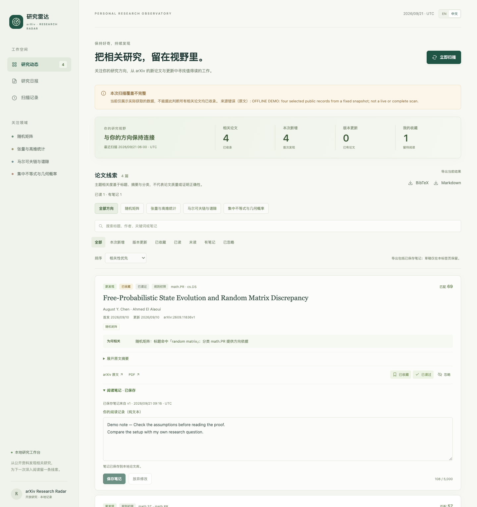
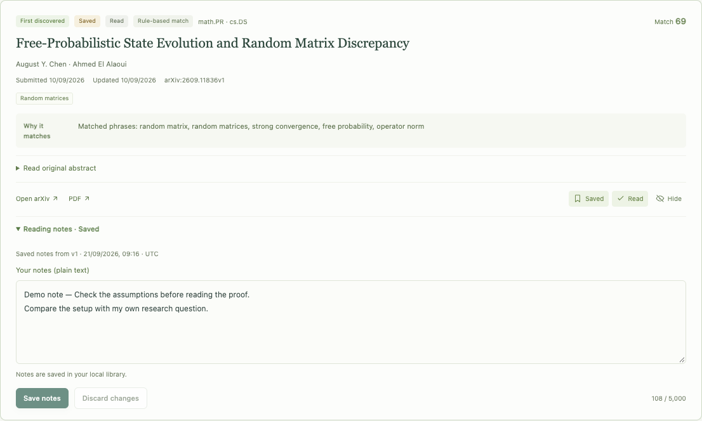

# arXiv Research Radar

**可安装的 Agent Skill 与本地研究雷达：自选研究方向，可解释推荐、版本追踪与有证据约束的论文解读。**

[English](README.md) · [安装 Skill](docs/agent-skill.md) · [Agent 操作合同](docs/agent-harness.md) · [配置说明](docs/configuration.md) · [参与贡献](CONTRIBUTING.md)

告诉 Agent 你研究什么，生成自己的研究配置，再持续跟进相关论文。知道每篇论文为什么被推荐，也知道扫描是否完整。默认数学配置只是示例，不限定你的研究方向。



## 能做什么

- **自选方向：** 用自然语言描述兴趣、选择模板，或编辑 JSON 配置；支持为 arXiv 覆盖的任意学科配置方向与关键词。
- **获取论文：** 按研究分类扫描 arXiv 官方元数据，支持分页、请求限速、重试与原始响应归档。
- **解释推荐：** 根据研究配置匹配标题和摘要，展示命中的关键词与方向。
- **追踪变化：** SQLite 去重合并跨分类记录，区分首次发现与版本更新，保留收藏和阅读反馈。
- **约束解读：** 导出待阅读队列，由人工或外部 Agent 生成解读；导入时核对论文版本和摘要原文引文。
- **集中阅读：** 收藏与已读独立保存，支持关联论文版本的阅读笔记、排序与搜索，以及按当前筛选结果导出 Markdown 清单或 BibTeX。
- **评测排序：** 使用明确标注的数据离线评测相关性，查看误推荐和漏推荐，并记录数据集与配置的指纹。
- **说明覆盖：** 扫描中断、达到分页上限或降级至 RSS 时明确标注；RSS 不会被当作完整历史扫描。

检索和界面**只依赖 Python 标准库，不需要模型 API Key**。程序自身不调用大模型；中文解读由外部 Agent 生成 JSON 后导入。详见 [Agent 操作合同](docs/agent-harness.md)。

## 安装为 Agent Skill

将**整个仓库**克隆到宿主的技能目录。仓库包含 `SKILL.md`、Python 运行时、配置模板与跨工作目录调用脚本，不能只复制一个指令文件。

Codex 安装示例：

```bash
mkdir -p ~/.agents/skills
git clone https://github.com/xiangyanjin/arxiv-research-radar.git ~/.agents/skills/arxiv-research-radar
```

如果目标目录已存在，复用现有安装或选择新目录，不要覆盖。Codex 的用户级技能目录见[官方 Build skills 文档](https://learn.chatgpt.com/docs/build-skills)。其他支持 `SKILL.md` 的宿主应按各自文档选择目录；这不代表已逐一验证所有平台。

安装后可以直接说：

> 用 $arxiv-research-radar，帮我关注 LLM Agent、工具调用和 Agent 评测，为当前项目建立配置，扫描最近七天。

> 用 $arxiv-research-radar，关注系外行星大气与透射光谱，单独建立一个论文库，不和我的 AI 论文混在一起。

宿主 Agent 将自然语言需求转成配置，并调用仓库内的 CLI；模型能力由宿主提供，不新增模型 SDK 或 API 服务。**安装 Skill、选择研究方向，不等于已经启用每日订阅。** [安装、自定义方向与跨目录命令 →](docs/agent-skill.md)

## 作为本地应用快速开始

需要 **macOS 或 Linux，以及 Python 3.10+**。扫描锁使用 `fcntl`，目前不支持 Windows。

```bash
git clone https://github.com/xiangyanjin/arxiv-research-radar.git
cd arxiv-research-radar
```

**先体验离线示例：**

```bash
python3 examples/load_demo.py
ARXIV_RADAR_DATA_DIR=data/demo python3 -m radar serve
```

打开 **[http://127.0.0.1:8765](http://127.0.0.1:8765)**。示例使用公开论文元数据的部分快照，存储在独立的 `data/demo` 目录；它不是实时或完整扫描结果。

**建立自己的论文库：** 停止示例服务，选择初始配置并运行：

```bash
python3 -m radar profiles
python3 -m radar init-profile --preset ai-agents --output config/profile.local.json --name "我的研究雷达" --timezone UTC
python3 -m radar validate-profile config/profile.local.json
python3 -m radar scan
python3 -m radar serve
```

可将 `ai-agents` 换成下表任意模板，再编辑生成的配置。`init-profile` 不覆盖已有文件；如果你已配置过，请复用该文件或指定新的输出路径。

使用界面时保持服务终端运行。也可以先启动 `serve`，再从界面发起扫描。

首次默认回溯 14 天。后续从上一次完整覆盖的范围继续扫描，并保留重叠区间，避免接口故障造成日期遗漏。选择较多分类时，首次扫描可能需要几分钟；进度和覆盖情况会保存到本地。

## 配置自己的方向

| 模板 | 初始方向 |
| --- | --- |
| `math-statistics` | 概率、随机矩阵与统计 |
| `ai-agents` | LLM Agent、工具调用与评测 |
| `quant-finance` | 量化金融研究 |
| `astrophysics` | 天体物理研究 |

模板只是起点，不是学科清单。你可以让 Skill 定制“分子图学习”等方向，也可以自行编辑分类、主题、关键词和可选的语境锚点，再运行配置校验。

在**子命令之后**使用 `--profile /绝对路径/profile.json --data-dir /绝对路径/data`，即可分别管理多个研究方向的论文库。原有的 `ARXIV_RADAR_PROFILE` 与 `ARXIV_RADAR_DATA_DIR` 环境变量仍可使用。[查看配置与自定义示例 →](docs/configuration.md)

## 从发现论文到积累阅读

同一篇论文可以同时标记为**收藏和已读**，也可以写下自己的阅读笔记。笔记在重新扫描和论文更新后仍会保留，并标明保存笔记时对应的论文版本。未提交的草稿保留在当前浏览器标签页，切换筛选或刷新后可以继续编辑，直到保存或取消。

通过**收藏、已读、未读、有笔记**筛选，按相关度、最近更新或标题排序。搜索范围包括阅读笔记。即使修改研究配置后相关度降低，已收藏、已读或有笔记的论文仍能在相应的阅读库视图中找到。界面的 **BibTeX / 阅读清单**导出当前筛选结果的全部论文，保持当前排序；Markdown 中会明确区分自己的笔记和论文元数据。

已有数据库会自动升级并保留历史阅读状态。详见[阅读库说明](docs/reading-library.md)。



## 让排序改进可以核对

```bash
python3 -m radar evaluate examples/ranking-eval.json --profile config/profile.json --k 5 --output output/evaluation.json
```

结果包含 Precision、Recall、F1、Top-k 指标及逐条误推荐和漏推荐。附带的 **20 条虚构、人工标注的样例是合成回归用例**，不能代表真实推荐准确率；它们刻意保留了关键词否定句和无关键词同义表达等失败案例。判断实际效果前，应换成自己领域的独立标注数据。详见[评测格式与指标说明](docs/evaluation.md)。

## Harness 如何工作

```text
arXiv API → 原始数据归档 → SQLite + 可解释排序 → 本地界面
    │                           │
    └─ RSS 降级（部分覆盖）       └─ 待解读队列
                                     │
                               人工 / 外部 Agent
                                     │
                                版本与引文校验
                                     │
                                研究简报与通知账本
```

```bash
python3 -m radar review-queue --output data/review-queue.json
# 由外部 Agent 阅读队列，生成 data/reviews.json。
python3 -m radar import-reviews data/reviews.json
python3 -m radar digest
```

根目录的 [SKILL.md](SKILL.md) 提供宿主 Agent 的操作指令，[Agent 合同](docs/agent-harness.md) 定义解读 JSON 与证据边界。宿主需要终端和文件访问能力；仓库未内置模型 SDK、消息连接器或调度服务。

## 每日使用

通过你选择的调度器定时运行 CLI。**克隆仓库或启动界面不会自动创建或启用定时任务。** [调度说明](docs/scheduling.md) 包含时区、失败处理和通知去重约定。

| 命令 | 用途 |
| --- | --- |
| `python3 -m radar scan --days 7` | 请求扫描最近七天 |
| `python3 -m radar status` | 查看最新运行与本地状态 |
| `python3 -m radar delivery-plan --output data/delivery-plan.json` | 生成尚未确认通知的论文和版本清单 |
| `python3 -m radar acknowledge data/delivery-plan.json` | 将准备通知的范围写入本地账本 |
| `python3 -m radar serve --port 8766` | 更换本地界面端口 |

`acknowledge` 是本地去重记录，不是邮件或消息平台的送达回执。仓库未内置邮件或聊天推送连接器。

## 当前边界

- 相关性分数来自规则匹配，**不代表概率、论文质量或证明正确性**。
- 解读证据限于**摘要**。原文引文校验可发现引用不匹配和过期版本，但不保证生成内容的每个判断都正确。
- RSS 公告日期与 API 首稿、修订日期分别存储。
- 收藏、已读等反馈会持久保存，目前不会训练排序模型。
- 这是本地单用户工具，服务绑定 `127.0.0.1`，不是托管的多人协作平台。

## 参与开发

```bash
python3 -m unittest discover -s tests -v
```

测试使用本地样例和模拟网络响应，不请求真实 arXiv。欢迎改进检索正确性、可解释排序、无障碍体验与可复现评测。提交前请阅读 [CONTRIBUTING.md](CONTRIBUTING.md)。

作者：[向彦瑾 / Yanjin Xiang](https://xiangyanjin.github.io/)。项目与 arXiv 无隶属关系。代码采用 [MIT 许可](LICENSE)，链接论文保留各自的许可。
